<div align="center">



<br>

<a href="https://github.com/Abhinav-Krishnan-10">

</a>


</div>

<br>

## 01 — about

I build **full-stack products with an AI edge** — interfaces that feel simple, backends that stay clean, and intelligent features that solve real problems.

```txt
focus      / AI + Full-Stack Development
degree     / B.Tech — Artificial Intelligence & Data Science
interests  / RAG · ML · APIs · Data · Product Engineering
currently  / building deeper full-stack + deployment skills
```

<br>

## 02 — how I build

<div align="center">

</div>

<br>

## 03 — toolbox

<div align="center">


</div>

<br>

## 04 — selected work

<table>
<tr>
<td width="50%" valign="top">

### KnowledgeOS
**Personal Knowledge Engine**

RAG-based knowledge platform for searching, querying and learning from personal documents.

`FastAPI` `PostgreSQL` `pgvector` `OCR` `Embeddings` `LLMs`

[explore →](https://github.com/Abhinav-Krishnan-10/KnowledgeOS)

</td>
<td width="50%" valign="top">

### Vector FAQ Assistant
**Semantic Retrieval System**

An intelligent FAQ assistant built around embeddings and vector similarity search.

`Vector Search` `Embeddings` `Semantic Retrieval`

[explore →](https://github.com/Abhinav-Krishnan-10/Vector-based-Product-FAQ-Assistant)

</td>
</tr>

<tr>
<td width="50%" valign="top">

### Football Analytics
**Data × Sports**

Analytics and machine-learning experiments built around football data.

`Analytics` `ML` `Visualization`

[explore →](https://github.com/Abhinav-Krishnan-10/football_analytics)

</td>
<td width="50%" valign="top">

### Fake News Prediction
**NLP Classification**

Text-classification pipeline for fake-news detection and model evaluation.

`TF-IDF` `NLP` `Classification`

[explore →](https://github.com/Abhinav-Krishnan-10/FakeNews_predict)

</td>
</tr>
</table>

<br>

## 05 — live signal

<div align="center">


<br><br>


</div>

<br>

## 06 — now loading

```txt
full-stack depth        ████████████████░░░░
AI engineering          ██████████████████░░
backend architecture    ███████████████░░░░░
deployment + devops     ███████████░░░░░░░░░
open source             ████████░░░░░░░░░░░░
```

<div align="center">

<a href="https://git.io/typing-svg">

</a>

</div>

<br>

## 07 — philosophy

<div align="center">

### `make it useful. make it clear. make it work.`

<sub>then make it better.</sub>

<br><br>


</div>
