<div align="center">


<br>

<a href="https://github.com/Abhinav-Krishnan-10">
  
</a>


</div>

---

# ✦ ABOUT / WHO I AM

I build **full-stack products with an AI core** — not isolated demos, not just frontends, and not just models.

I care about the whole experience:

> **design → interface → API → database → intelligence → deployment**

```yaml
name: Abhinav Krishnan
role: AI + Full-Stack Developer
degree: B.Tech — Artificial Intelligence & Data Science
interests:
  - modern web applications
  - backend systems
  - RAG and semantic search
  - machine learning
  - AI-powered products
  - scalable product architecture
current_mode: "build → test → learn → ship → repeat"
```

---

# ✦ PRODUCT FLOW

<div align="center">

</div>

---

# ✦ TECH CONSTELLATION

<div align="center">

### Frontend


### Backend


### Data


### AI / ML


### Build / Ship


</div>

---

# ✦ FEATURED BUILDS

<table>
<tr>
<td width="50%" valign="top">

## 🧠 KnowledgeOS
**Personal Knowledge Engine**

A RAG-powered system that converts personal documents into a searchable, interactive AI workspace.

**Core**
- FastAPI backend
- PostgreSQL + pgvector
- OCR
- local embeddings
- semantic retrieval
- Gemini / OpenAI / Ollama
- summaries, flashcards, quizzes

[**open project →**](https://github.com/Abhinav-Krishnan-10/KnowledgeOS)

</td>

<td width="50%" valign="top">

## 💬 Vector FAQ Assistant
**Semantic Search System**

An intelligent FAQ assistant designed around embeddings and vector similarity.

**Core**
- semantic retrieval
- vector search
- embeddings
- question answering

[**open project →**](https://github.com/Abhinav-Krishnan-10/Vector-based-Product-FAQ-Assistant)

</td>
</tr>

<tr>
<td width="50%" valign="top">

## ⚽ Football Analytics
**Data × Sports**

Exploring football through data analysis, visualization, and ML workflows.

[**open project →**](https://github.com/Abhinav-Krishnan-10/football_analytics)

</td>

<td width="50%" valign="top">

## 📰 Fake News Prediction
**NLP Classification**

Text classification project for identifying fake and real news with ML and NLP.

[**open project →**](https://github.com/Abhinav-Krishnan-10/FakeNews_predict)

</td>
</tr>

<tr>
<td width="50%" valign="top">

## 🏥 PatientRecords
**Digital Records Platform**

Application focused on managing patient information and backend data workflows.

[**open project →**](https://github.com/Abhinav-Krishnan-10/PatientRecords)

</td>

<td width="50%" valign="top">

## 🧩 LeetCode
**DSA / Problem Solving**

A growing collection of coding practice and algorithmic problem solving.

[**open project →**](https://github.com/Abhinav-Krishnan-10/LeetCode)

</td>
</tr>
</table>

---

# ✦ CURRENT RADAR

<div align="center">

</div>

---

# ✦ GITHUB SIGNALS

<div align="center">


<br><br>


<br><br>


</div>

---

# ✦ BUILD MODE

```text
FULL-STACK SYSTEMS      ██████████████████░░
AI ENGINEERING          ███████████████████░
BACKEND ARCHITECTURE    █████████████████░░░
FRONTEND EXPERIENCE     ████████████████░░░░
DATA ENGINEERING        ███████████████░░░░░
DEVOPS / CLOUD          ████████████░░░░░░░░
```

<div align="center">

<a href="https://git.io/typing-svg">

</a>

</div>

---

# ✦ PRINCIPLES

<div align="center">

### `make it useful`
### `make it reliable`
### `make it beautiful`
### `make it intelligent`

<br>

**then ship it.**

<br><br>


</div>
