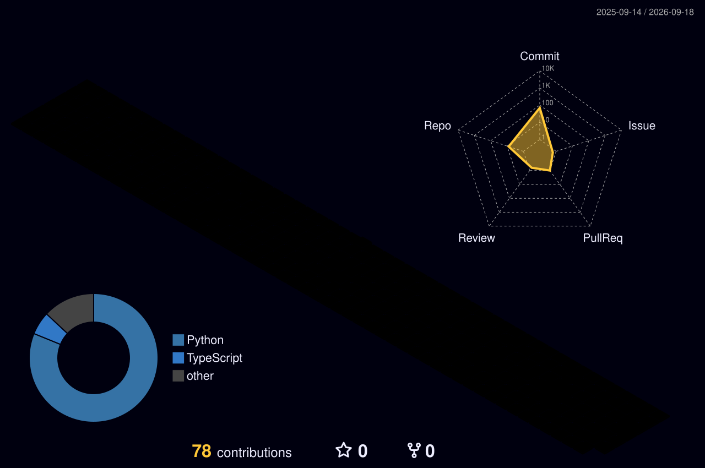
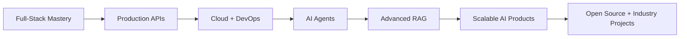

<!--
╔══════════════════════════════════════════════════════════════════════╗
║         ABHINAV KRISHNAN — AI × FULL-STACK DEVELOPER UNIVERSE      ║
╚══════════════════════════════════════════════════════════════════════╝
-->

<div align="center">


<a href="https://git.io/typing-svg">
  
</a>

<br/>


<br/><br/>


</div>

---

## 🛰️ `SYSTEM://IDENTITY`

```js
const developer = {
    name: "Abhinav Krishnan",
    role: "AI + Full-Stack Developer",
    degree: "B.Tech — Artificial Intelligence & Data Science",

    buildMode: [
        "Frontend Experiences",
        "Backend APIs",
        "Databases",
        "AI Systems",
        "RAG Applications",
        "Data Products"
    ],

    currentMission:
        "Turn ambitious ideas into useful, intelligent, end-to-end products.",

    status: "learning • building • debugging • shipping 🚀"
};
```

<div align="center">

> ### I don't want to build only a frontend, only an API, or only an AI demo.
> ### I want to build the **entire experience**.

</div>

---

# 🧭 Developer Universe

<div align="center">

```text
                         ╭──────────────╮
                         │     IDEA     │
                         ╰──────┬───────╯
                                │
                                ▼
                    ╭──────────────────────╮
                    │      EXPERIENCE      │
                    │   UI • UX • React    │
                    ╰──────────┬───────────╯
                               │
                         HTTP / JSON
                               │
                               ▼
                    ╭──────────────────────╮
                    │       BACKEND        │
                    │ FastAPI • Node • API │
                    ╰──────────┬───────────╯
                               │
                     Queries / Events
                               │
                               ▼
                ╭──────────────────────────────╮
                │            DATA              │
                │ PostgreSQL • MongoDB • SQL   │
                ╰──────────────┬───────────────╯
                               │
                         Context / Data
                               │
                               ▼
                ╭──────────────────────────────╮
                │        INTELLIGENCE          │
                │ ML • LLM • RAG • Embeddings │
                ╰──────────────┬───────────────╯
                               │
                               ▼
                     ╭─────────────────╮
                     │  REAL PRODUCT   │
                     │       🚀        │
                     ╰─────────────────╯
```

</div>

---

# ⚡ `STACK://CORE`

<div align="center">

### 🎨 FRONTEND


<br/><br/>

`Responsive UI` • `Component Design` • `State` • `API Integration` • `Modern UX`

---

### ⚙️ BACKEND


<br/><br/>

`REST APIs` • `Authentication` • `Business Logic` • `Async Workflows` • `Services`

---

### 🗄️ DATA LAYER


<br/><br/>

`PostgreSQL` • `MySQL` • `MongoDB` • `pgvector` • `Schema Design`

---

### 🤖 INTELLIGENCE LAYER


<br/><br/>


---

### 🛠️ SHIPPING TOOLKIT


</div>

---

# 🪐 `PROJECTS://ORBIT`

<table>
<tr>

<td width="50%" valign="top">

### 🧠 KnowledgeOS
**Personal Knowledge Engine • RAG • FastAPI • pgvector**

A system that turns personal documents into an interactive AI-powered knowledge space.

**Orbit modules**
- semantic retrieval
- vector embeddings
- OCR pipeline
- RAG chat
- PostgreSQL + pgvector
- Gemini / OpenAI / Ollama
- summaries, quizzes & flashcards

<a href="https://github.com/Abhinav-Krishnan-10/KnowledgeOS">

</a>

</td>

<td width="50%" valign="top">

### 🛒 E-Commerce
**Frontend • Backend • APIs • Product Workflow**

A full-stack playground for building the complete commerce experience.

**Orbit modules**
- responsive interface
- frontend/backend communication
- product flows
- database integration
- application architecture

<a href="https://github.com/Abhinav-Krishnan-10/e-commerce">

</a>

</td>

</tr>

<tr>

<td width="50%" valign="top">

### 💬 Vector FAQ Assistant
**Embeddings • Semantic Search • Intelligent Q&A**

A retrieval-based assistant that finds meaning instead of only matching keywords.

<a href="https://github.com/Abhinav-Krishnan-10/Vector-based-Product-FAQ-Assistant">

</a>

</td>

<td width="50%" valign="top">

### 🤖 Job Assistant
**AI Workflow • Automation • Intelligent Assistance**

Exploring AI-powered career workflows and practical automation.

<a href="https://github.com/Abhinav-Krishnan-10/Job_Assistant">

</a>

</td>

</tr>

<tr>

<td width="50%" valign="top">

### ⚽ Football Analytics
**Data Science • Analysis • ML**

Applying analytics and ML thinking to football data.

<a href="https://github.com/Abhinav-Krishnan-10/football_analytics">

</a>

</td>

<td width="50%" valign="top">

### 📰 Fake News Prediction
**NLP • TF-IDF • Classification**

A machine-learning pipeline for text classification and fake-news detection.

<a href="https://github.com/Abhinav-Krishnan-10/FakeNews_predict">

</a>

</td>

</tr>
</table>

<div align="center">

<a href="https://github.com/Abhinav-Krishnan-10/PatientRecords">

</a>

<a href="https://github.com/Abhinav-Krishnan-10/todo-list">

</a>

<a href="https://github.com/Abhinav-Krishnan-10/LeetCode">

</a>

</div>

---

# 🌌 `3D://CONTRIBUTION_UNIVERSE`

<div align="center">

### Every contribution becomes part of the landscape.



<sub>
Generated automatically from my GitHub contribution history.
</sub>

</div>

---

# 📡 `TELEMETRY://GITHUB`

<div align="center">


<br/>


<br/><br/>


</div>

---

# 🧪 `LAB://CURRENT_EXPERIMENTS`

```txt
[01] Full-Stack Architecture      ██████████████████░░  90%
[02] Generative AI / RAG          ███████████████████░  95%
[03] Machine Learning             █████████████████░░░  85%
[04] Backend Engineering          ████████████████░░░░  80%
[05] Frontend Engineering         ███████████████░░░░░  75%
[06] DSA / Problem Solving        ██████████████░░░░░░  70%
[07] Cloud / DevOps               ███████████░░░░░░░░░  55%
```

<div align="center">


</div>

---

# 🗺️ `ROADMAP://NEXT`



---

# 🧩 `PHILOSOPHY://BUILD`

<div align="center">

### `DESIGN → BUILD → CONNECT → BREAK → DEBUG → SHIP → EVOLVE`

<br/>


</div>

---

# 🔭 `CONTACT://SIGNAL`

<div align="center">

<a href="https://github.com/Abhinav-Krishnan-10">

</a>

<br/><br/>


<br/><br/>

### `// Build useful things. Make them intelligent. Make them beautiful.`


</div>
