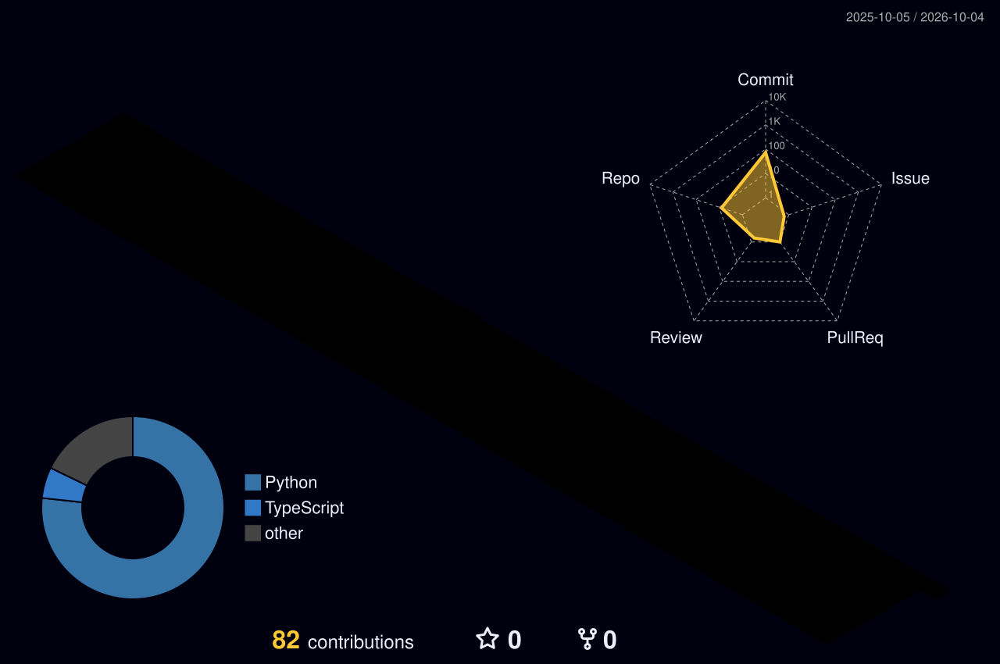

<!--
  ╔══════════════════════════════════════════════════════════════╗
  ║        ABHINAV KRISHNAN // INTERACTIVE PROFILE README       ║
  ╚══════════════════════════════════════════════════════════════╝
-->

<div align="center">


<a href="https://github.com/Abhinav-Krishnan-10">
  
</a>

<br/>


</div>

---

<table>
<tr>
<td width="55%" valign="top">

### `> identity.scan()`

```yaml
name: Abhinav Krishnan
focus:
  - Artificial Intelligence
  - Machine Learning
  - Full-Stack Development
  - Intelligent IoT Systems
  - Robotics

currently_building:
  - AI-powered applications
  - Real-world automation systems
  - Edge + IoT prototypes
  - Experimental developer tools

philosophy: "Build. Break. Learn. Rebuild better."
```

</td>
<td width="45%" valign="top">

### `> signal.status()`

```text
[●] AI / ML               ACTIVE
[●] Full Stack            ACTIVE
[●] Robotics              BUILDING
[●] IoT / Edge AI         BUILDING
[●] Open Source           EXPLORING
[●] Weird Ideas           ALWAYS
```

</td>
</tr>
</table>

---

<div align="center">

## ⚡ TECH MATRIX


</div>

---

## ◈ SYSTEMS I LIKE TO BUILD

<table>
<tr>
<td width="50%" valign="top">

### 🤖 Intelligent Systems
Computer vision, ML pipelines, inference systems, automation and practical AI.

### 🌐 Full-Stack Products
Interfaces that feel polished, backends that stay clean, APIs that actually make sense.

</td>
<td width="50%" valign="top">

### 🛰️ Edge + IoT
ESP32, sensors, MQTT, dashboards, real-time monitoring and local decision-making.

### 🦾 Robotics
Autonomous systems, perception, navigation and hardware/software integration.

</td>
</tr>
</table>

---

<div align="center">

## 🧊 3D CONTRIBUTION WORLD

<!-- Generated automatically by .github/workflows/profile-3d.yml -->


<sub>Every block is a tiny piece of the build log.</sub>

</div>

---

<div align="center">

## 🧬 ACTIVITY STREAM

<picture>
  <source media="(prefers-color-scheme: dark)" srcset="https://raw.githubusercontent.com/Abhinav-Krishnan-10/Abhinav-Krishnan-10/output/github-snake-dark.svg">
  <source media="(prefers-color-scheme: light)" srcset="https://raw.githubusercontent.com/Abhinav-Krishnan-10/Abhinav-Krishnan-10/output/github-snake.svg">
  
</picture>

</div>

---

<div align="center">

## ◇ GITHUB TELEMETRY


</div>

---

## `// build_log`

```text
01  idea appears
02  prototype gets messy
03  bugs become personality traits
04  system finally works
05  refactor until respectable
06  ship
07  find a harder problem
08  repeat ↻
```

---

<div align="center">

## 🌌 CURRENT TRANSMISSION

> *I like projects where software escapes the screen and starts interacting with the real world.*

<br/>

<a href="https://github.com/Abhinav-Krishnan-10?tab=repositories">
  
</a>

<a href="https://github.com/Abhinav-Krishnan-10">
  
</a>

<br/><br/>


</div>
