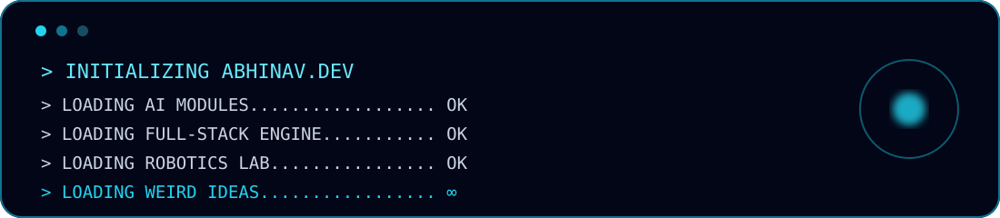
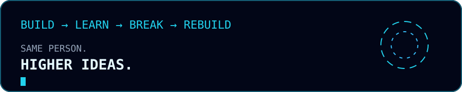

<!-- ═══════════════════════════════════════════════════════════════════════ -->
<!--                  ABHINAV KRISHNAN // GITHUB PROFILE                  -->
<!-- ═══════════════════════════════════════════════════════════════════════ -->

<div align="center">


<a href="https://github.com/Abhinav-Krishnan-10">
  
</a>

<br/>


</div>

---

<div align="center">
  
</div>

## `> identity.scan()`

<table>
<tr>
<td width="57%" valign="top">

```yaml
name: Abhinav Krishnan

role:
  - AI & Data Science Student
  - Full-Stack Developer
  - Intelligent Systems Builder

focus:
  - Applied AI / Machine Learning
  - RAG & Knowledge Systems
  - Full-Stack Products
  - Computer Vision
  - Edge AI / IoT
  - Robotics

philosophy: "Build → Break → Learn → Rebuild better."
```

</td>
<td width="43%" valign="top">

```text
STATUS
─────────────────────────
AI / ML            ACTIVE
Full-Stack         ACTIVE
RAG / LLM Apps     ACTIVE
Computer Vision    BUILDING
Edge / IoT         BUILDING
Robotics           EXPLORING
Open Source        GROWING
```

</td>
</tr>
</table>

---

<div align="center">

# ⚡ TECH MATRIX


</div>

---

# 🚀 `FEATURED_BUILDS`

<table>
<tr>
<td width="50%" valign="top">

<a href="https://github.com/Abhinav-Krishnan-10/KnowledgeOS">
  
</a>

**KnowledgeOS**  
Personal knowledge-management system with semantic search, RAG, local embeddings, OCR, pgvector and configurable LLM providers.

`FastAPI` `PostgreSQL` `pgvector` `RAG` `OCR` `LLMs`

</td>

<td width="50%" valign="top">

<a href="https://github.com/Abhinav-Krishnan-10/e-commerce">
  
</a>

**Modern E-Commerce Platform**  
Full-stack commerce platform with authentication, product management, admin tooling, PostgreSQL and Stripe checkout.

`Next.js` `Prisma` `PostgreSQL` `Stripe` `Tailwind`

</td>
</tr>

<tr>
<td width="50%" valign="top">

<a href="https://github.com/Abhinav-Krishnan-10/football_analytics">
  
</a>

**Football Analytics**  
An analytics-focused experimental project centered on extracting insight from football data and intelligent analysis workflows.

`Analytics` `Data` `Experimentation`

</td>

<td width="50%" valign="top">

<a href="https://github.com/Abhinav-Krishnan-10/FakeNews_predict">
  
</a>

**Fake News Prediction**  
Machine-learning project exploring text classification and predictive modeling for fake-news detection.

`Machine Learning` `NLP` `Classification`

</td>
</tr>
</table>

<div align="center">

### `more.repositories()`

<a href="https://github.com/Abhinav-Krishnan-10/Job_Assistant">

</a>
<a href="https://github.com/Abhinav-Krishnan-10/Vector-based-Product-FAQ-Assistant">

</a>
<a href="https://github.com/Abhinav-Krishnan-10/PatientRecords">

</a>
<a href="https://github.com/Abhinav-Krishnan-10/LeetCode">

</a>

</div>

---

# ◈ `WHAT_I_BUILD`

<table>
<tr>
<td width="25%" align="center">

### 🧠 AI SYSTEMS
RAG applications  
Machine learning  
Computer vision  
Automation  

</td>

<td width="25%" align="center">

### 🌐 FULL-STACK
Product interfaces  
APIs & backends  
Dashboards  
Realtime systems  

</td>

<td width="25%" align="center">

### 🛰️ EDGE + IoT
ESP32  
Sensors  
MQTT  
Local intelligence  

</td>

<td width="25%" align="center">

### 🤖 ROBOTICS
Perception  
Navigation  
Autonomy  
System integration  

</td>
</tr>
</table>

---

<div align="center">

# 🧊 `3D_CONTRIBUTION_WORLD`


<sub>Every block is another piece of the build log.</sub>

</div>

---

<div align="center">

# 🐍 `ACTIVITY_STREAM`

<picture>
  <source media="(prefers-color-scheme: dark)" srcset="https://raw.githubusercontent.com/Abhinav-Krishnan-10/Abhinav-Krishnan-10/output/github-snake-dark.svg">
  <source media="(prefers-color-scheme: light)" srcset="https://raw.githubusercontent.com/Abhinav-Krishnan-10/Abhinav-Krishnan-10/output/github-snake.svg">
  
</picture>

</div>

---

<div align="center">

# 📡 `GITHUB_TELEMETRY`


<br/>


</div>

---

<div align="center">

# 📈 `CONTRIBUTION_FREQUENCY`


</div>

---

## `// build_log`

```diff
+ 01  idea appears
+ 02  prototype begins
! 03  something breaks
! 04  debugging becomes character development
+ 05  system finally works
+ 06  refactor until respectable
+ 07  ship it
+ 08  find a harder problem
+ 09  repeat ↻
```

---

<div align="center">

# 🌌 `CURRENT_TRANSMISSION`

> **I like projects where software escapes the screen and starts interacting with the real world.**

<br/>

<a href="https://github.com/Abhinav-Krishnan-10?tab=repositories">

</a>

<a href="https://github.com/Abhinav-Krishnan-10">

</a>

<br/><br/>



<br/>


</div>
